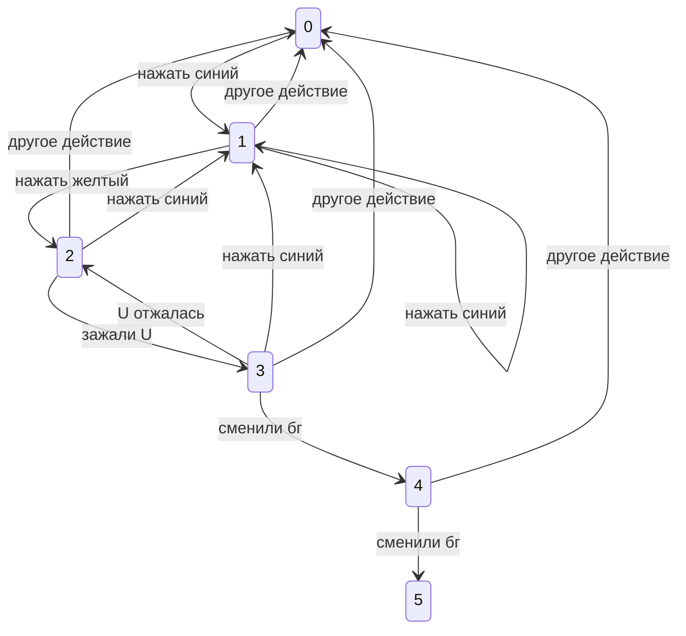

0   не нажат цвет           нужно: нажать синий   -> 1       
1   нажан синий             нужно: нажать желтый  -> 2       нужно: нажать синий -> 2
2   нажаты оба              нужно: зажалась U     -> 3

0   нажаты оба, зажата U    U отжалась -> 2       сменили бг -> 4
1   нажаты оба, зажата U, бг сменен 1 раз       U отжалась -> 2    сменили бг -> 5
2   финал

$ x \times y = \sum_{i=1}^5 j_i $

